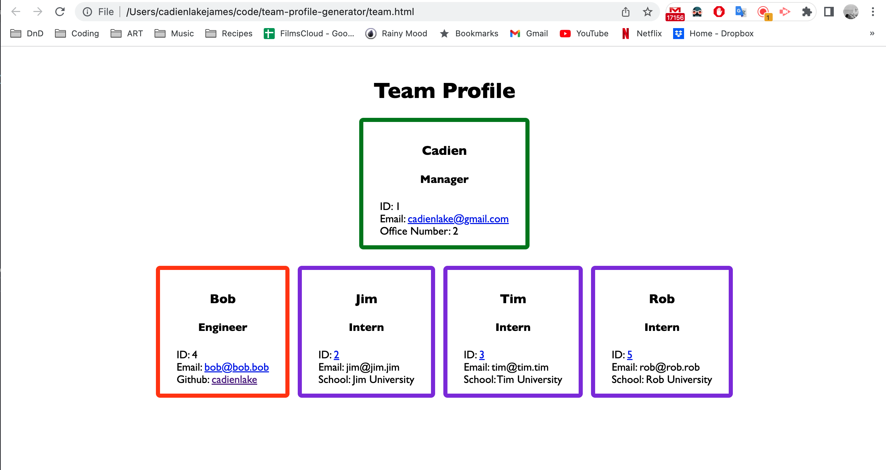

# Team-Profile-Generator

> Video Demonstration [_here_](https://drive.google.com/file/d/1wFCAlpmtobLCaFMR2oyCt_d5XilG5njK/view?usp=share_link).

## Table of Contents

- [General Info](#general-information)
- [Screenshot](#screenshot)
- [Features](#features)
- [Project Status](#project-status)
- [Acknowledgements](#acknowledgements)

## General Information

-This is a command line application for entering team employee information and generating a styled webpage with that information.

## Screenshot

## Features

This application utilizes
-inquirer
-fs

The HTML is blueprinted,ammended with entered information, and generated in the index.js file. The constructors for each employee role are in separte js files in the lib folder. There are tests for the functionality of each of these employee js files in the _tests_ folder.

## Project Status

Project is: _finished_.

## Acknowledgements

Give credit here.

- This project was created in class office hours with our instructor and other students.
